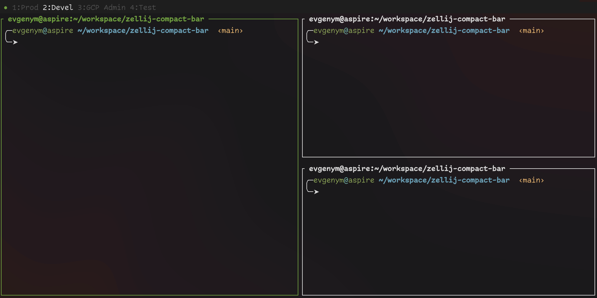

<div align="center">

# Zellij Compact Bar

Minimalistic tab bar plugin for [zellij](https://github.com/zellij-org/zellij).

This project is a fork of
[github.com/tarkah/zellij-bare-bar](https://github.com/tarkah/zellij-bare-bar).

</div>

## Screenshots



## Plugin Settings

- `active_color` &mdash; color of the text of an active tab segment;
- `inactive_color` &mdash; color of the text of an inactive tab segment;
- `locked_color` &mdash; color of the prefix
- `text_background_color` &mdash; background color of a tab segment;
- `background_color` &mdash; background color of the rest of the plugin's pane;
- `dot` &mdash; dot character to use in the prefix (reflects mode)
(for example, `"•"`);
- `dot_locked_color` &mdash; dot color in the locked mode;
- `dot_normal_color` &mdash; dot color in the normal mode;
- `dot_action_color` &mdash; dot color in other modes (when an action
is being performed).

## Complete Configuration Example

```kdl
layout {
    pane size=1 borderless=true {
        plugin location="file:$HOME/.config/zellij/plugins/compact-bar.wasm" {
            inactive_color "#505050"
            text_background_color "#1e1e1e"
            background_color "#1e1e1e"
            dot "•"
            dot_locked_color "#404040"
            dot_normal_color "#70a040"
            dot_action_color "#ffb070"
        }
    }
    pane
    pane size=1 borderless=true {
        plugin location="status-bar"
    }
}
```
